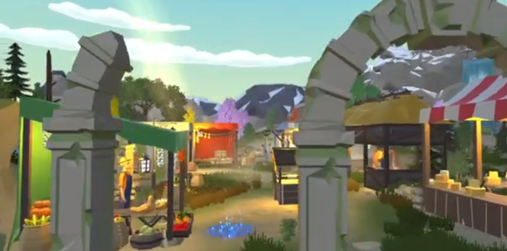
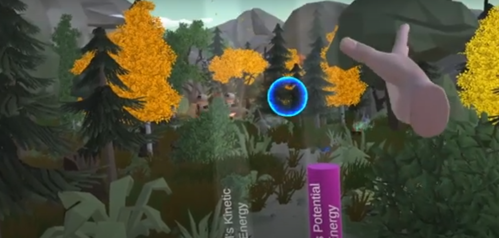

**Embark on an Epic Journey through the Land of Energy!**

## 📌 Table of Contents

1. [About the Game](#about-the-game)
2. [Features](#features)
3. [Gameplay](#gameplay)
4. [Types of Energy](#types-of-energy)
5. [Installation](#installation)
6. [Usage](#usage)
7. [Contribution](#contribution)
8. [License](#license)
9. [Contact](#contact)
10. [Acknowledgements](#acknowledgements)

## ⚡️ About the Game

Welcome to the "Land of Energy," known as "LEVEL UP GAME," where science meets adventure! This level-up game takes you on a thrilling journey through a world brimming with different forms of energy. Your mission is to explore, learn, and harness these energies to level up your character.

## 🎮 Features

### Description

- **Educational Adventure**: Learn about various types of energy while having fun in an immersive gaming environment.
- **Progressive Gameplay**: Start with basic energy types and advance to more complex forms as you level up.
- **Customizable Avatars**: Personalize your character and embark on energy-rich quests.

### Key Features

- **Potential and Kinetic Energy**: Explore the dynamics of motion, from potential to kinetic energy.
- **Chemical Energy through Food**: Solve puzzles and gather food items to unlock chemical energy.
- **Elastic Energy in Food**: Discover how energy can be stored and released in elastic objects.
- **Heat Energy**: Brave the challenges of heat and utilize it to overcome obstacles.

### Screenshots

## 🎯 Gameplay

In the "Land of Energy," you'll:

1. **Begin with Potential Energy**: Start your journey with potential energy, learning the basics of energy conversion.
2. **Collect Food for Chemical Energy**: Solve puzzles to find food items, converting them into valuable chemical energy.
3. **Explore Elastic Objects**: Encounter elastic objects and uncover the secrets of storing and releasing energy.
4. **Master Heat Energy**: Tackle heat-based challenges and harness this powerful energy source.

## ⚛️ Types of Energy

In the game, you'll encounter various forms of energy, including:

- **Potential Energy**: Energy of position or stored energy.
- **Kinetic Energy**: Energy of motion.
- **Chemical Energy**: Stored in food items you collect.
- **Elastic Energy**: Found in springy objects.
- **Heat Energy**: Overcome challenges involving heat.

## 💻 Installation

**To embark on your energy-filled adventure:**

1. **Requirements**
   - Compatible gaming platform or PC.
   - Internet connection for updates and multiplayer mode.

2. **Setup**
   - Download the "Land of Energy" game from our official website.
   - Follow the installation instructions provided on the website.

## 🎮 Usage

**Getting started with the "Land of Energy" is a breeze:**

1. Launch the game on your chosen platform.
2. Create your character and dive into the vibrant world of energy.

## 🤝 Contribution

We welcome contributions from passionate gamers and developers. Whether you have ideas for new energy types, gameplay enhancements, or bug fixes, your contributions can help make this game even more exciting.

## 📃 License

This project is licensed under the [LICENSE NAME] - see the [LICENSE.md](LICENSE.md) file for details.

## 📞 Contact

If you have questions, feedback, or need assistance, please contact us at [contact@example.com](mailto:contact@example.com).

## 🙏 Acknowledgements

We extend our gratitude to the gaming and science communities for their support in making the "Land of Energy" an educational and entertaining adventure.
