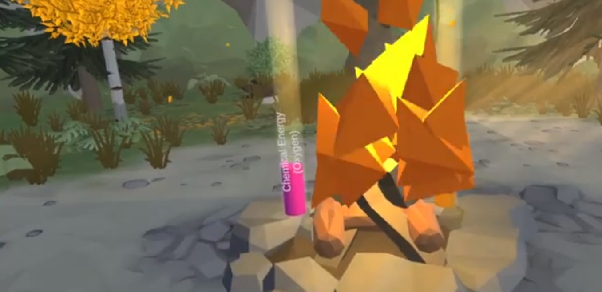

# Level Up Games VR

**Embark on a journey of energy exploration with Level Up Games VR. Dive into the captivating world of potential and kinetic energy, chemical energy, elastic energy, and heat energy through engaging and educational VR experiences, brought to you by EnergyVR Studio.**

## 📌 Table of Contents

1. [About the Project](#about-the-project)
2. [Energy Exploration](#energy-exploration)
3. [Installation](#installation)
4. [Usage](#usage)
5. [Contribution](#contribution)
6. [License](#license)
7. [Contact](#contact)
8. [Acknowledgements](#acknowledgements)

## ⚡ About the Project

Level Up Games VR is not just a set of games; it's an immersive learning experience that delves into the fascinating world of energy. Explore the fundamental concepts of energy through interactive VR adventures and unlock the secrets of motion, chemical reactions, elasticity, and heat.

## 💥 Energy Exploration

### Potential and Kinetic Energy

- **Dynamics of Motion**: Explore the transition from potential to kinetic energy in thrilling virtual scenarios.
- **Interactive Challenges**: Engage in activities that demonstrate the principles of energy transformation.

### Chemical Energy through Food

- **Puzzle Solving**: Solve puzzles and gather food items to unlock the secrets of chemical energy.
- **Interactive Chemistry**: Learn about energy transfer in living organisms while navigating through captivating environments.

### Elastic Energy in Food

- **Energy Storage**: Discover how energy can be stored and released in elastic objects.
- **Hands-On Learning**: Interact with objects that demonstrate elastic energy principles.

### Heat Energy

- **Heat Challenges**: Brave the challenges of heat and utilize it to overcome obstacles.
- **Practical Applications**: Learn how heat energy can be harnessed to perform various tasks.

### Gallery

## 💻 Installation

**Follow these instructions to experience Level Up Games VR:**

1. **Requirements**
   - VR headset (e.g., Oculus Rift, HTC Vive)
   - Compatible VR-ready PC or gaming console
2. **Setup**
   - Download the Level Up Games VR package from the releases section.
   - Install the game following the on-screen instructions.

## 🎮 Usage

**Here's how to get started with Level Up Games VR:**

1. Put on your VR headset and ensure it's properly calibrated.
2. Launch the game from your VR platform.
3. Select the energy exploration experience you want to embark on.
4. Engage with the VR scenarios to learn and experiment with various energy concepts.

## 🤝 Contribution

We welcome contributions from the educational and VR communities. If you'd like to contribute, please fork the repository and create a new pull request.

## 📄 License

Distributed under the XYZ License. See `LICENSE` for more information.

## 📞 Contact

XREV Studio
- Email: contact@xrevrstudio.com
- Twitter: [@EnergyXREVtudio](https://twitter.com/EnergyVRStudio)

## 👏 Acknowledgements

- [Unity Engine](https://unity.com/)
- [SteamVR](https://developer.valvesoftware.com/wiki/SteamVR)

